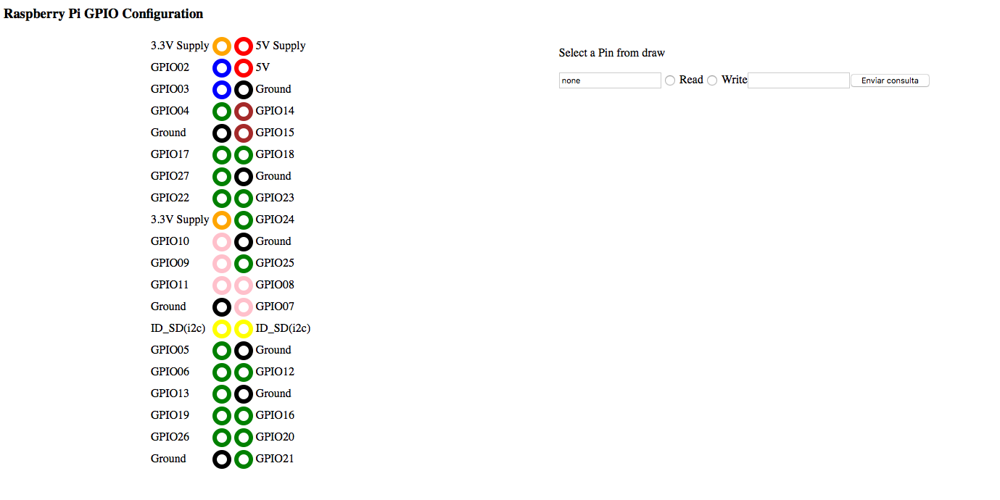

##React-RPI


This application allow users to configure the GPIO pins on the RPI on an interactive way. 

This application has been made with node.js to run on your RPI. If you want to run locally see the instrucction at the bottom.

###Getting Started

First of all you should clone the respository:

```
git clone https://github.com/luisfpinto/react-rpi
```

Then install all the dependencies

```
cd react-rpi
npm install
```

To start the application run:

```
node index.js
```

Access to http://localhost:8000 and then you will see:



###Run on your laptop

If you have tried to run this application on your laptop you have propably seen this error:

```
... no suitable image found ...
```

The only thing you have to do to try this application on your laptop is comment ```var gpio = require('rpi-gpio'); ```
on the helper.js file and index.js file 

## To do

- [ ] Log messages
- [ ] Tests
- [ ] Write option. Change to a list
- [ ] Add onChange pin functionality
- [ ] Improve UI
- [ ] Pin number control
